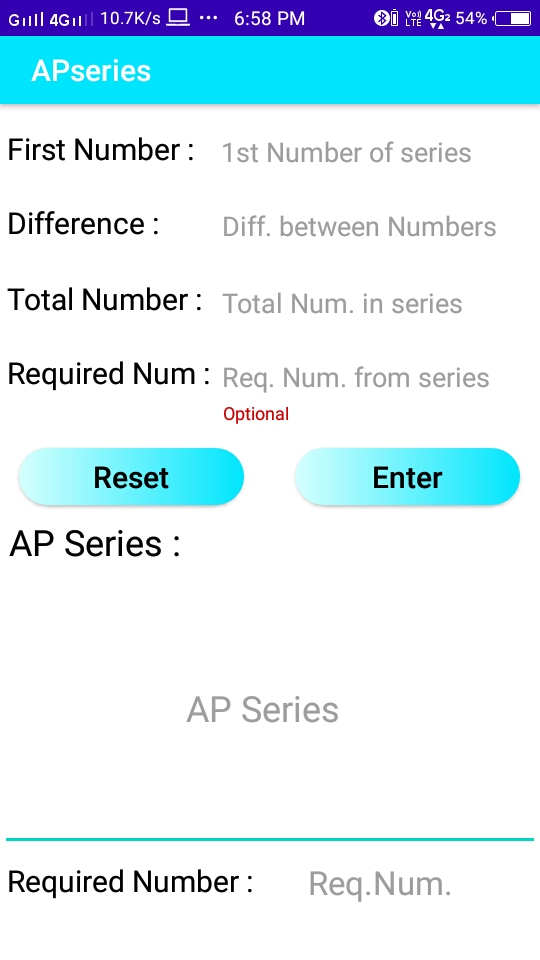

# Matrix

Matrix is an android application which is developed to calculate some basic mathematics problem. The main purpose behind to develop this application is to ease the work of students and help them to save there time. Many time students often get confused while solving mathematic problems. This app intended to help them by solving there problem in just few clicks.

## Application Screenshots :-

!

!

